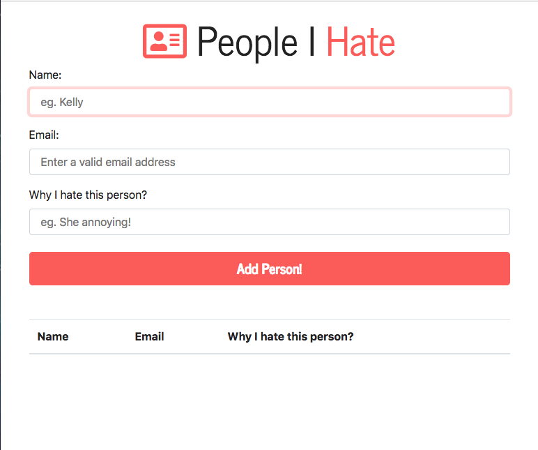
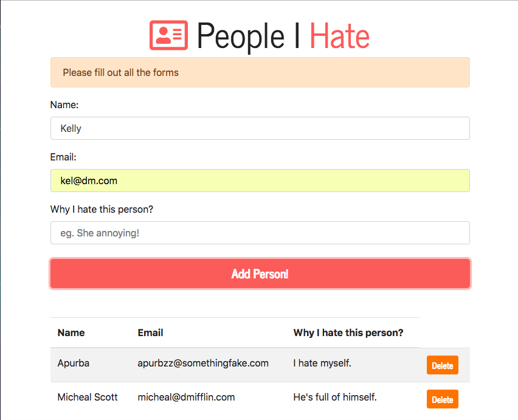

# people_i_hate
A simple Vanilla JavaScript application that allows the user to create a list of people they hate while storing the data on local storage.

### Features
* Main functionalities completely coded in Vanilla Javascript includes:
  * Adding people you hate by filling up details via a form.
  * Deleting people you wish to remove from your list.
  * Form validation with success and alert messages.
  * Keeping your haters persistent in memory via local storage.
* Page made responsive using Bootstrap and FontAwesome icons.

#### The primary application:

#### Adding and deleting person:

#### Validation with warning message:

#### Local Storage status in developer tools:

